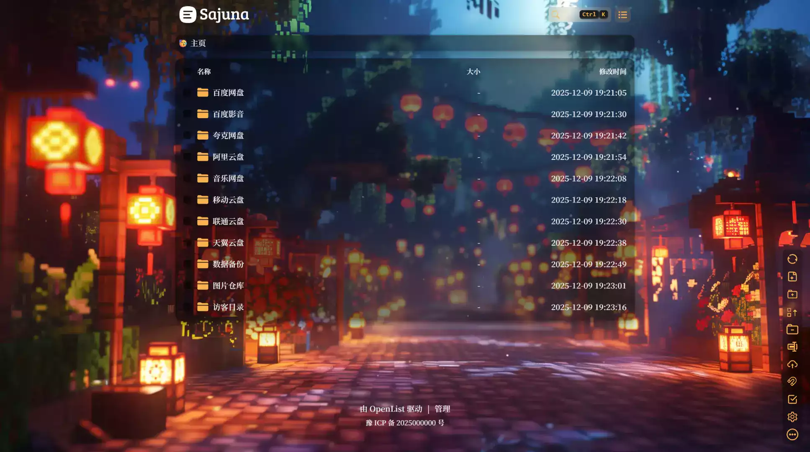

## 🎨 OpenList Moe

**为OpenList全局注入半透明模糊效果，支持日夜切换，覆盖文件列表/预览/后台等全组件**

> 一个基于文件列表程序OpenList的美化

## ✨ 特性

#### 🌓 兼容日/夜间模式 - 不同背景与配色

#### 🪟 全元素毛玻璃效果 - 半透明元素结合背景模糊

#### 🎨 多层次透明度调校 - 完美的视觉层次

## 🖼️ 截图



<table>
  <tr>
    <td></td>
    <td></td>
  <tr>
    <tr>
    <td></td>
    <td></td>
  <tr>
</table>

<table>
  <tr>
    <td></td>
    <td></td>
    <td></td>
  <tr>
  <tr>
    <td></td>
    <td></td>
    <td></td>
  <tr>
</table>

## 🚀 使用

### 自定义头部

```
<!-- 更改href和font-family以更改字体，删除本<link>和字体css则使用OpenList默认字体 -->
<link href="https://fonts.googleapis.com/css2?family=Noto+Serif+SC:wght@600&display=swap" rel="stylesheet">
<link href="https://cdn.jsdmirror.com/gh/SajunaOo/OpenList-Moe/dist/css/OpenList-Moe.min.css" rel="stylesheet">
<style>
/** 更改url以更改背景图，删除本css或留空url将调用默认背景图 */
:root {
  --moe-color-theme: 248, 179, 78; /** 必填 */
  --moe-bg-image-desktop: url("https://cdn.jsdmirror.com/gh/SajunaOo/OpenList-Moe-Image/light_desktop/早秋_2.webp");/** 默认白天模式桌面端背景图 */
  --moe-bg-image-mobile: url("https://cdn.jsdmirror.com/gh/SajunaOo/OpenList-Moe-Image/light_mobile/沉浸感_3.webp");/** 默认白天模式移动端背景图 */
}

.hope-ui-dark {
  --moe-bg-image-desktop: url("https://cdn.jsdmirror.com/gh/SajunaOo/OpenList-Moe-Image/dark_desktop/新春快乐_5.webp");/** 默认夜间模式桌面端背景图 */
  --moe-bg-image-mobile: url("https://cdn.jsdmirror.com/gh/SajunaOo/OpenList-Moe-Image/dark_mobile/沉浸感_6.webp");/** 默认夜间模式移动端背景图 */
}

/** 字体 */
body, .markdown-body, .aplayer {
  font-family: 'Noto Serif SC' !important;
}
</style>
```

### 自定义内容

```
<script src="https://cdn.jsdmirror.com/gh/SajunaOo/OpenList-Moe/dist/js/OpenList-Moe.min.js"></script>

<!-- 如果您不需要添加备案号，请删除以下代码 -->
<div class="beian-container" style="text-align: center;" hidden>
  <a class="hope-anchor hope-c-PJLV-idrWMwW-css" href="https://beian.miit.gov.cn" target="_blank" rel="noopener" style="font-size: 14px;">
    豫 ICP 备 2025000000 号</a>
</div>

<script>
// 备案信息加载
(()=>{let _o;const _f=()=>{const e=document.querySelector('.footer'),t=document.querySelector('.beian-container');return e&&t&&(e.append(t),t.hidden=!1,_o?.disconnect(),_o=null,!0)};_f()||(_o=new MutationObserver(_f), _o.observe(document,{childList:1,subtree:1}))})();
</script>
```

### 更多修改

如果你想在自定义特定元素的样式，请参考[main.scss](https://github.com/SajunaOo/OpenList-Moe/blob/main/src/styles/main.scss)中的**全局变量定义**

比如我想修改复选框与开关的颜色，可以添加以下代码：

```
:root {
  --moe-color-checkbox: #f8b34e;
}

.hope-ui-dark {
  --moe-color-checkbox: #f8b34e;
}
```