<div align="center">
  
<!-- 项目头像 -->
<a href="https://github.com/SajunaOo/OpenList-Moe" target="_blank">
  
</a>

<!-- 项目标题 -->
<h1>OpenList Moe</h1>

<!-- 徽标区 -->
<p>
  <!-- Release Version -->
  <a href="https://github.com/SajunaOo/OpenList-Moe/releases"></a>
   <!-- Downloads -->
  <a href="https://github.com/SajunaOo/OpenList-Moe/releases"></a>
  <!-- Build Status -->
  <a href="https://github.com/SajunaOo/OpenList-Moe/actions/workflows/release.yml"></a>
  <!-- License -->
  <a href="LICENSE"></a>
  <!-- Stars -->
  <a href="https://github.com/SajunaOo/OpenList-Moe/stargazers"></a>
</p>

<!-- 项目简介 -->
<p>
  <strong>为 OpenList 全局注入半透明模糊效果<br>支持日夜切换，覆盖文件列表/预览/后台等全组件</strong>
</p>

</div>

## ✨ 特性

🌓 **兼容日/夜间模式** - 自动适配不同背景与配色方案

🪟 **全元素毛玻璃效果** - 半透明元素结合背景模糊

🎨 **多层次透明度调校** - 完美的视觉层次感

📱 **响应式设计** - 完美适配桌面端和移动端

## 🖼️ 截图

### 桌面端

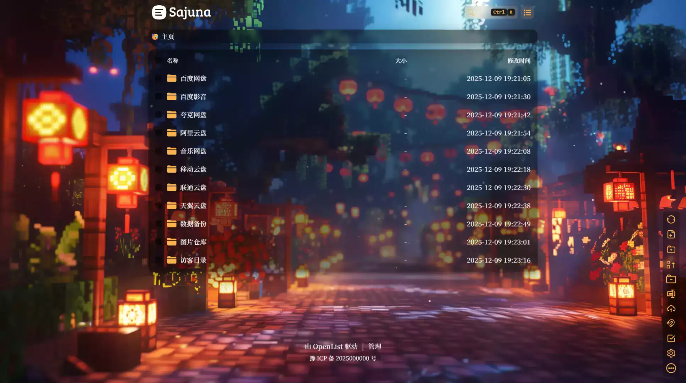

<table>
  <tr>
    <td>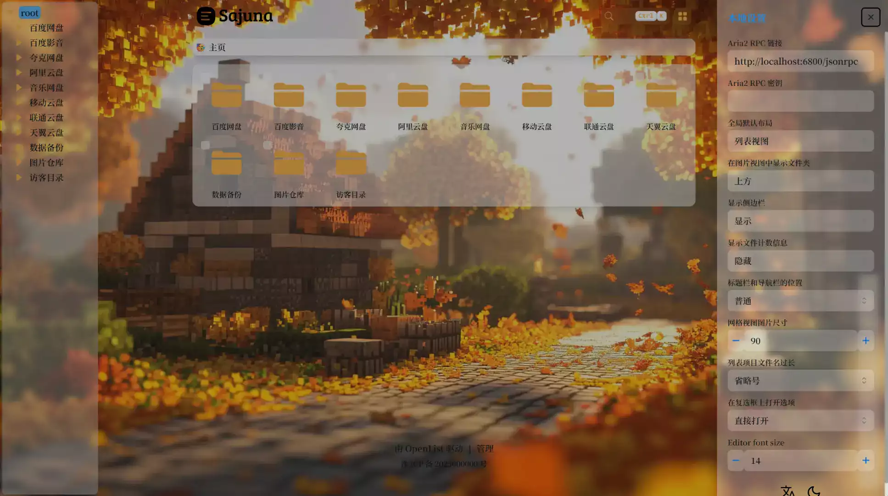</td>
    <td>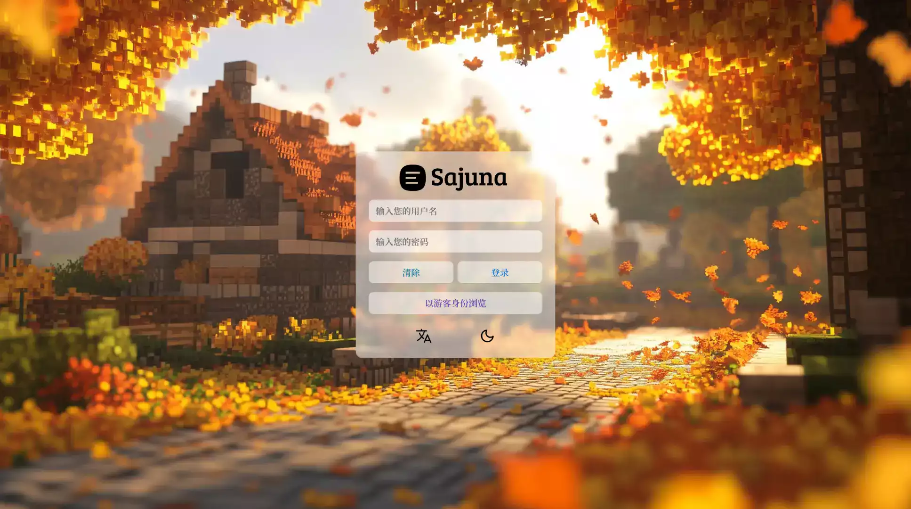</td>
  </tr>
  <tr>
    <td>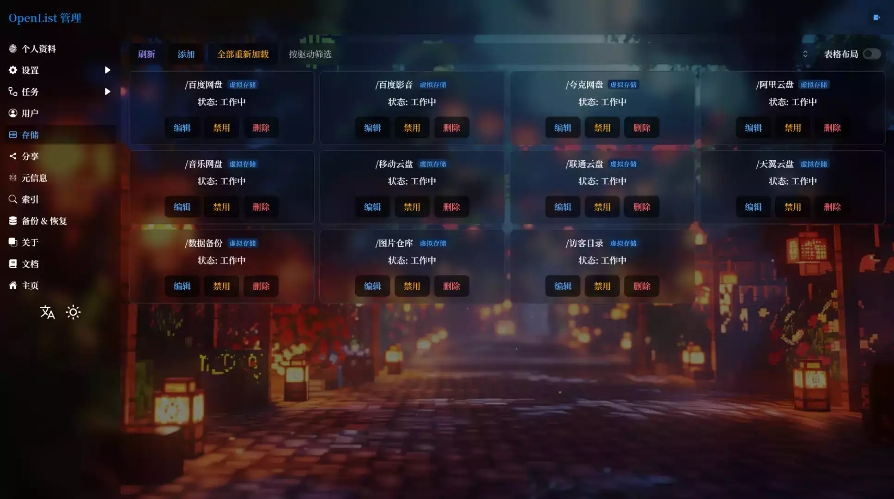</td>
    <td>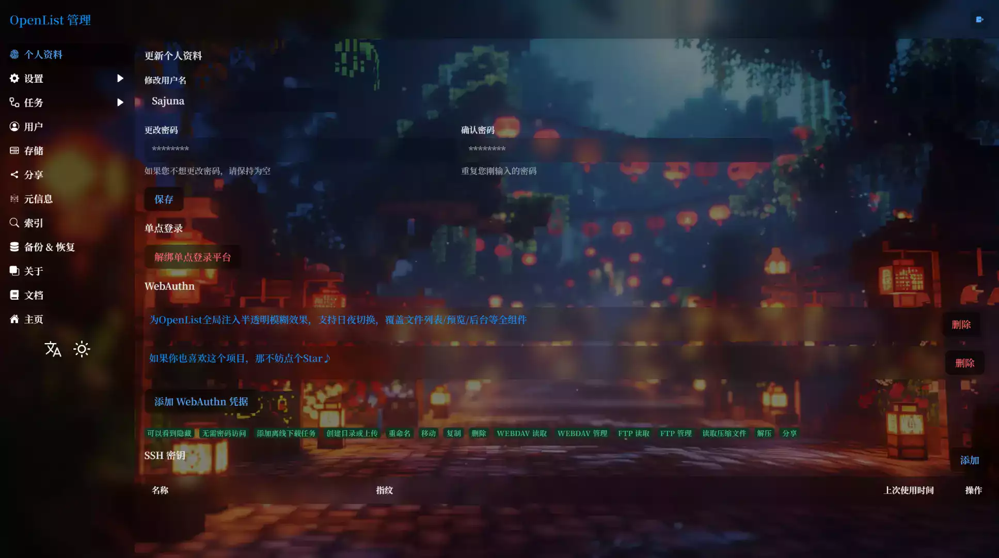</td>
  </tr>
</table>

### 移动端

<table>
  <tr>
    <td>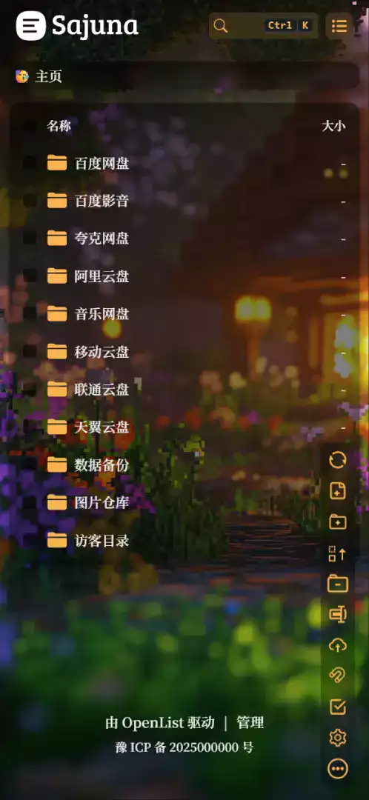</td>
    <td>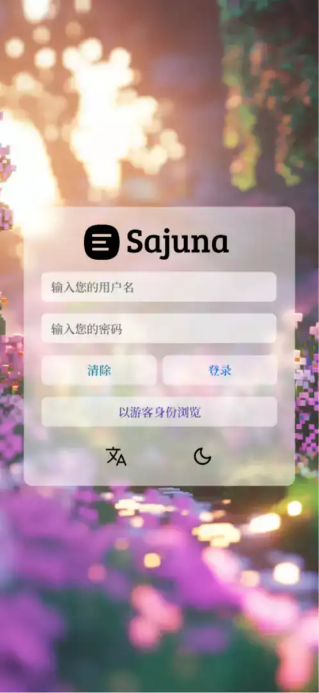</td>
    <td>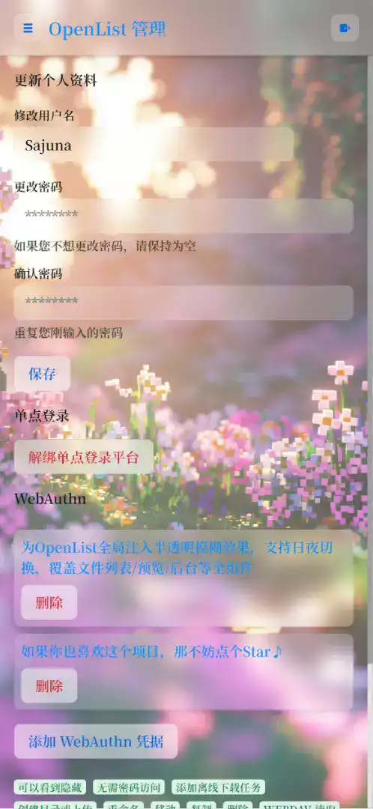</td>
  </tr>
  <tr>
    <td>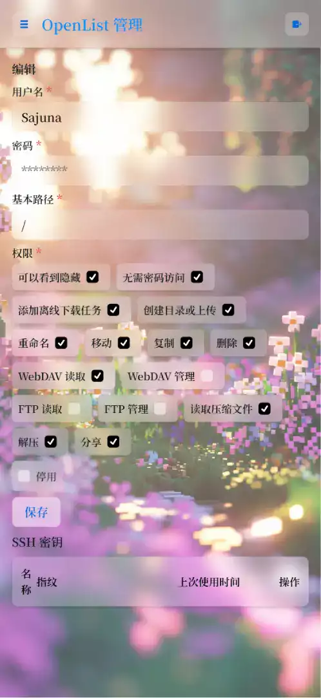</td>
    <td>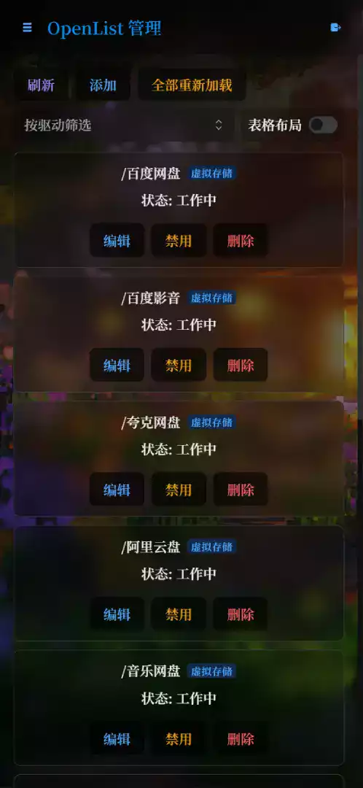</td>
    <td>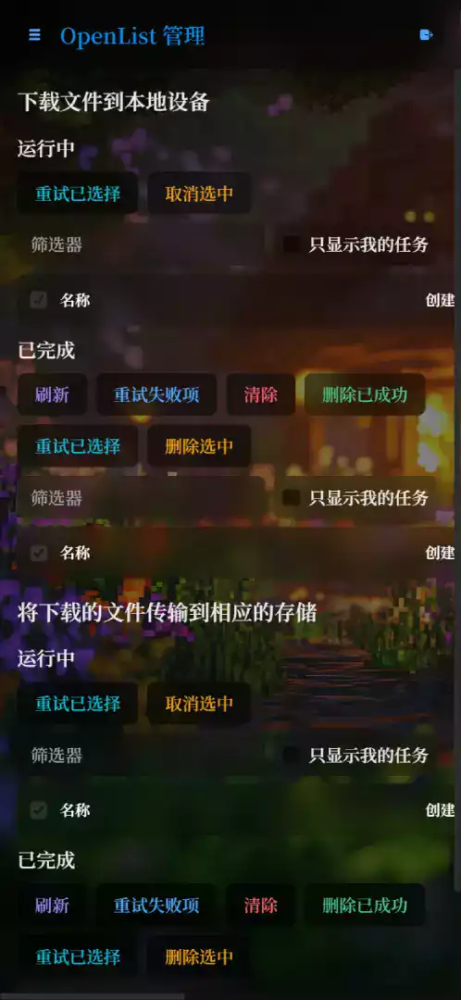</td>
  </tr>
</table>

## 🚀 快速开始

### 基础样式

在 OpenList 的 **自定义头部** 添加以下代码：

```html
<!-- 修改 href 和 font-family 以自定义字体，删除字体 <link> 和字体 CSS 则使用 OpenList 默认字体 -->
<link href="https://fonts.googleapis.com/css2?family=Noto+Serif+SC:wght@600&display=swap" rel="stylesheet">
<link href="https://cdn.jsdmirror.com/gh/SajunaOo/OpenList-Moe@dist/css/OpenList-Moe.min.css" rel="stylesheet">

<style>
/** 修改 URL 以自定义背景，删除背景 CSS 则使用 OpenList Moe 默认背景 */
:root {
  --moe-color-theme: 248 179 78; /** 主题色（必填） */
  --moe-bg-image-desktop: url("https://cdn.jsdmirror.com/gh/SajunaOo/OpenList-Moe-Image/light_desktop/早秋_2.webp"); /** 默认白天模式桌面端背景图 */
  --moe-bg-image-mobile: url("https://cdn.jsdmirror.com/gh/SajunaOo/OpenList-Moe-Image/light_mobile/沉浸感_3.webp"); /** 默认白天模式移动端背景图 */
}

.hope-ui-dark {
  --moe-bg-image-desktop: url("https://cdn.jsdmirror.com/gh/SajunaOo/OpenList-Moe-Image/dark_desktop/新春快乐_5.webp"); /** 默认夜间模式桌面端背景图 */
  --moe-bg-image-mobile: url("https://cdn.jsdmirror.com/gh/SajunaOo/OpenList-Moe-Image/dark_mobile/沉浸感_6.webp"); /** 默认夜间模式移动端背景图 */
}

/**
 * 自定义字体
 * 
 * - 全局字体
 * - Markdown 区域字体
 * - Aplayer 音乐播放器字体
 * - ArtPlayer 视频播放器和 tooltip 提示字体
 */
body, .markdown-body, .aplayer, .art-video-player, [class*=hint--]:after {
  font-family: 'Noto Serif SC' !important;
}
</style>
```

### JavaScript 和备案信息

在 OpenList 的 **自定义内容** 添加以下代码：

```html
<script src="https://cdn.jsdmirror.com/gh/SajunaOo/OpenList-Moe@dist/js/OpenList-Moe.min.js"></script>

<!-- 如果你不需要添加备案号，请删除以下代码 -->
<div class="beian-container" style="text-align: center;" hidden>
  <a class="hope-anchor hope-c-PJLV-idrWMwW-css" href="https://beian.miit.gov.cn" target="_blank" rel="noopener" style="font-size: 14px;">
    豫 ICP 备 2025000000 号</a>
</div>

<script>
/** 备案信息加载 */
(()=>{const e=new MutationObserver(()=>{const o=document.querySelector(".footer"),n=document.querySelector(".beian-container");o&&n&&(o.append(n),n.hidden=!1,e.disconnect(),clearTimeout(t))}),t=setTimeout(()=>e.disconnect(),5e3);e.observe(document.body,{childList:!0,subtree:!0})})();
</script>
```

## 🎨 自定义配置

### 查看源码变量

如果你需要深度定制特定元素的样式，可以参考 [main.scss](https://github.com/SajunaOo/OpenList-Moe/blob/main/src/styles/main.scss) 中的 **全局变量定义** 部分。

### 示例：修改复选框颜色

```css
:root {
  --moe-color-checkbox: #f8b34e; /* 白天模式复选框颜色 */
}

.hope-ui-dark {
  --moe-color-checkbox: #f8b34e; /* 夜间模式复选框颜色 */
}
```

## 📁 项目结构

```
OpenList-Moe/
├── src/
│   ├── styles/
│   │   └── main.scss     # 样式文件
│   └── script/
│       └── main.js       # 脚本文件
├── dist/                 # 构建输出目录
├── screenshot/           # 截图目录
├── build.js              # 构建脚本
└── README.md             # 项目文档
```

## 📄 许可证

本项目采用 **AGPL-3.0** 许可证。详见 [LICENSE](LICENSE) 文件。

## 🤩 贡献者

<a href="https://github.com/SajunaOo/OpenList-Moe/graphs/contributors">
  
</a>
