<div align="center">

<!-- 项目头像 -->
<a href="https://github.com/SajunaOo/OpenList-Moe" target="_blank">
  
</a>

<!-- 项目标题 -->
<h1>OpenList Moe</h1>

<!-- 徽标区 -->
<p>
  <!-- Release Version -->
  <a href="https://github.com/SajunaOo/OpenList-Moe/releases"></a>
  <!-- Downloads -->
  <a href="https://github.com/SajunaOo/OpenList-Moe/releases"></a>
  <!-- Build Status -->
  <a href="https://github.com/SajunaOo/OpenList-Moe/actions/workflows/release.yml"></a>
  <!-- License -->
  <a href="LICENSE"></a>
  <!-- Stars -->
  <a href="https://github.com/SajunaOo/OpenList-Moe/stargazers"></a>
</p>

<!-- 项目简介 -->
<p>
  <strong>为 OpenList 全局注入半透明模糊效果<br>支持日夜切换，覆盖文件列表 / 预览 / 后台等全组件</strong>
</p>

</div>

## ✨ 特性

- 🌓 **兼容日 / 夜间模式** — 自动适配不同背景与配色方案

- 🪟 **全元素毛玻璃效果** — 半透明元素结合背景模糊

- 🎨 **多层次透明度调校** — 完美的视觉层次感

- 📱 **响应式设计** — 完美适配桌面端和移动端

## 🖼️ 截图

### 桌面端

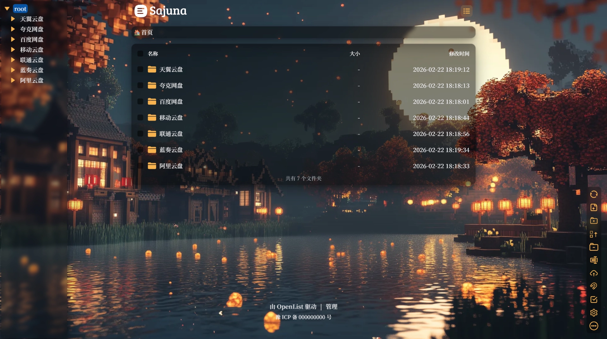

<table>
  <tr>
    <td>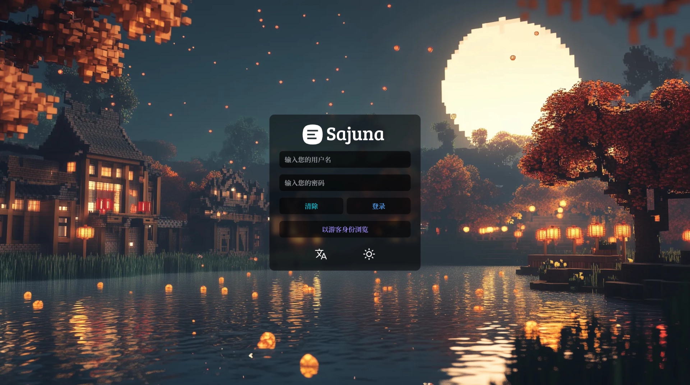</td>
    <td>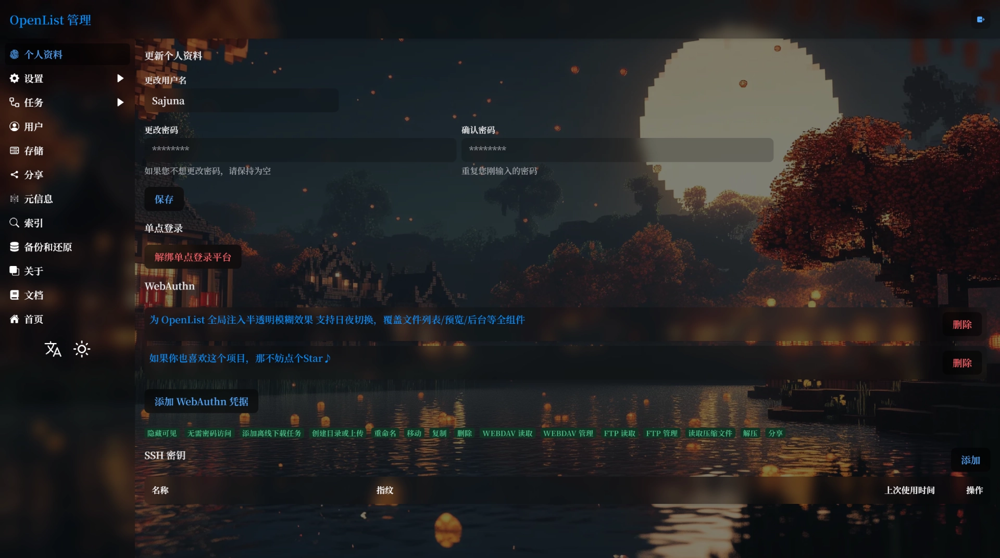</td>
  </tr>
  <tr>
    <td>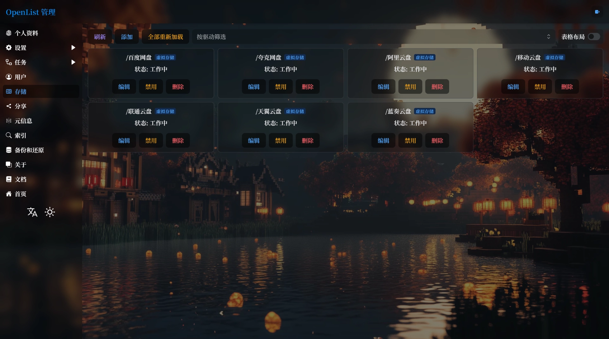</td>
    <td>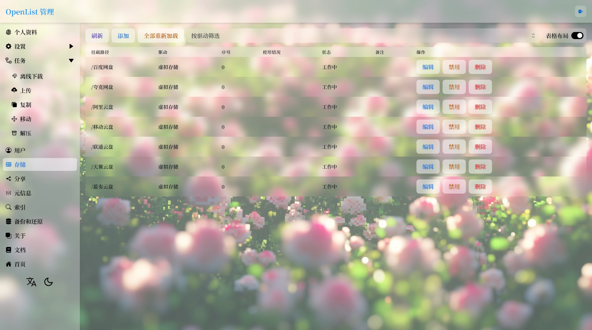</td>
  </tr>
</table>

### 移动端

<table>
  <tr>
    <td>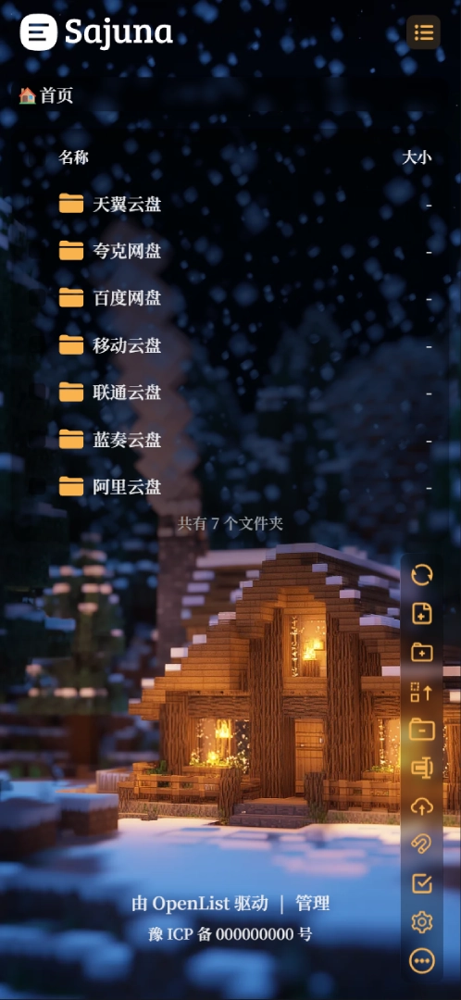</td>
    <td>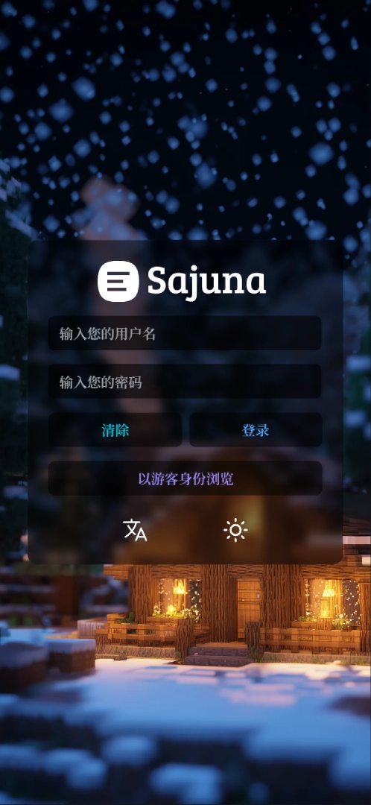</td>
    <td>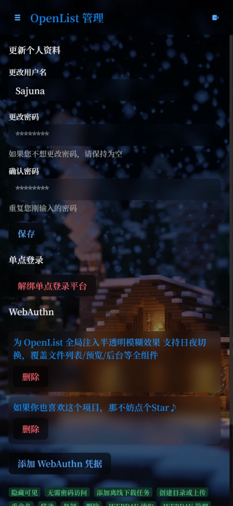</td>
  </tr>
  <tr>
    <td>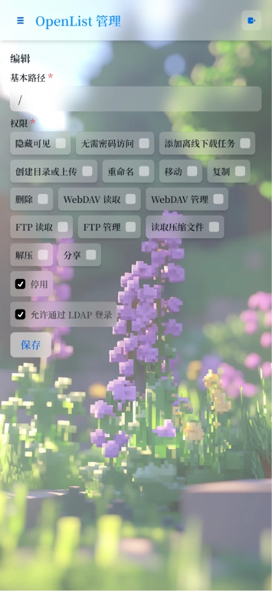</td>
    <td>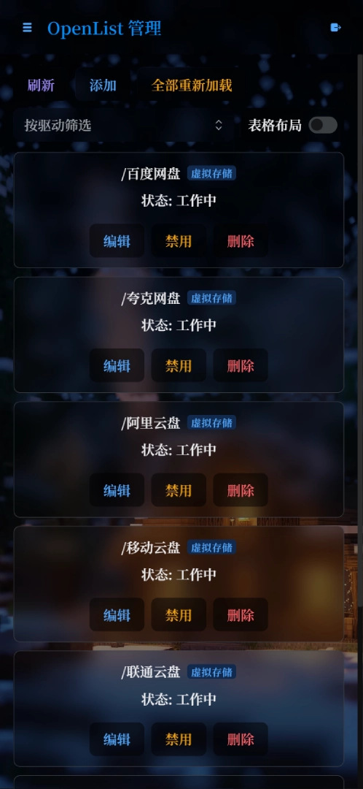</td>
    <td>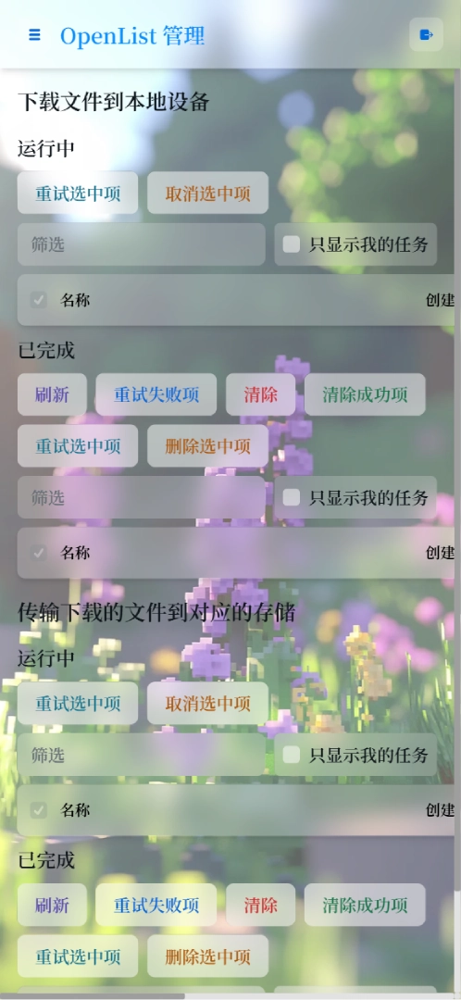</td>
  </tr>
</table>

## 🚀 快速开始

### 基础样式

在 OpenList 的 **自定义头部** 添加以下代码：

> 💡 **背景**：建议使用简洁素雅的图片，花哨的图片容易影响界面可读性与视觉效果；修改下方 URL 即可自定义，删除背景 CSS 则使用 OpenList Moe 默认背景。
>
> 💡 **字体**：修改下方 `href` 和 `font-family` 可自定义字体；删除字体 `<link>` 和字体 CSS 则使用 OpenList 默认字体。

```html
<link href="https://fonts.googleapis.com/css2?family=Noto+Serif+SC:wght@600&display=swap" rel="stylesheet">
<link href="https://cdn.jsdmirror.com/gh/SajunaOo/OpenList-Moe@dist/css/OpenList-Moe.min.css" rel="stylesheet">

<style>
:root {
  /** 白天模式背景图 */
  --moe-bg-image-desktop: url("https://cdn.jsdmirror.com/gh/SajunaOo/Image/OpenList-Moe/light_desktop/玫瑰花海_1.webp");
  --moe-bg-image-mobile: url("https://cdn.jsdmirror.com/gh/SajunaOo/Image/OpenList-Moe/light_mobile/沉浸感_5.webp");
}

.hope-ui-dark {
  /** 夜间模式背景图 */
  --moe-bg-image-desktop: url("https://cdn.jsdmirror.com/gh/SajunaOo/Image/OpenList-Moe/dark_desktop/中秋佳节_3.webp");
  --moe-bg-image-mobile: url("https://cdn.jsdmirror.com/gh/SajunaOo/Image/OpenList-Moe/dark_mobile/雪中小屋_5.webp");
}

/**
 * 自定义字体
 * 覆盖：全局 / Markdown / Aplayer / ArtPlayer / Tooltip
 */
body,.markdown-body,.aplayer,.art-video-player,[class*="hint--"]:after {
  font-family: "Noto Serif SC" !important;
}
</style>
```

### JavaScript 和备案信息

在 OpenList 的 **自定义内容** 添加以下代码：

> 💡 **备案**：不需要备案号时，删除 `MOE_CONFIG` 配置；使用工信部链接时，可以删除 `beian.link` 配置。
>
> 💡 **JS**：`MOE_CONFIG` 配置必须放在 JS 之前，否则配置不会生效。

```html
<script>
window.MOE_CONFIG = {
  beian: {
    enabled: true,
    text: "豫 ICP 备 2025000000 号",
    link: "https://beian.miit.gov.cn"
  }
};
</script>
<script src="https://cdn.jsdmirror.com/gh/SajunaOo/OpenList-Moe@dist/js/OpenList-Moe.min.js"></script>
```

> 📖 如需高级配置（元素样式、完整 MOE_CONFIG、常见问题），请查阅 **[高级配置文档](ADVANCED.md)**。

## 📁 项目结构

```
OpenList-Moe/
├── src/
│   ├── styles/
│   │   └── main.scss     # 样式文件
│   └── script/
│       └── main.js       # 脚本文件
├── dist/                 # 构建输出
├── screenshot/           # 效果截图
├── build.js              # 构建脚本
├── README.md             # 项目文档
└── ADVANCED.md           # 高级配置
```

## 📄 许可证

本项目采用 **AGPL-3.0** 许可证。详见 **[LICENSE](LICENSE)** 文件。

## 🤩 贡献者

<a href="https://github.com/SajunaOo/OpenList-Moe/graphs/contributors">
  
</a>
